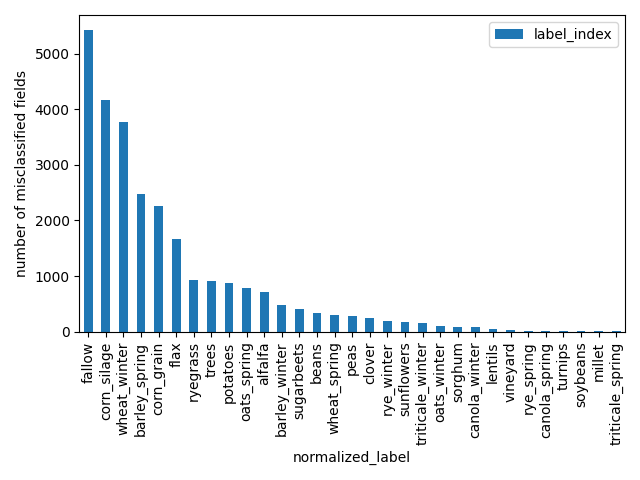
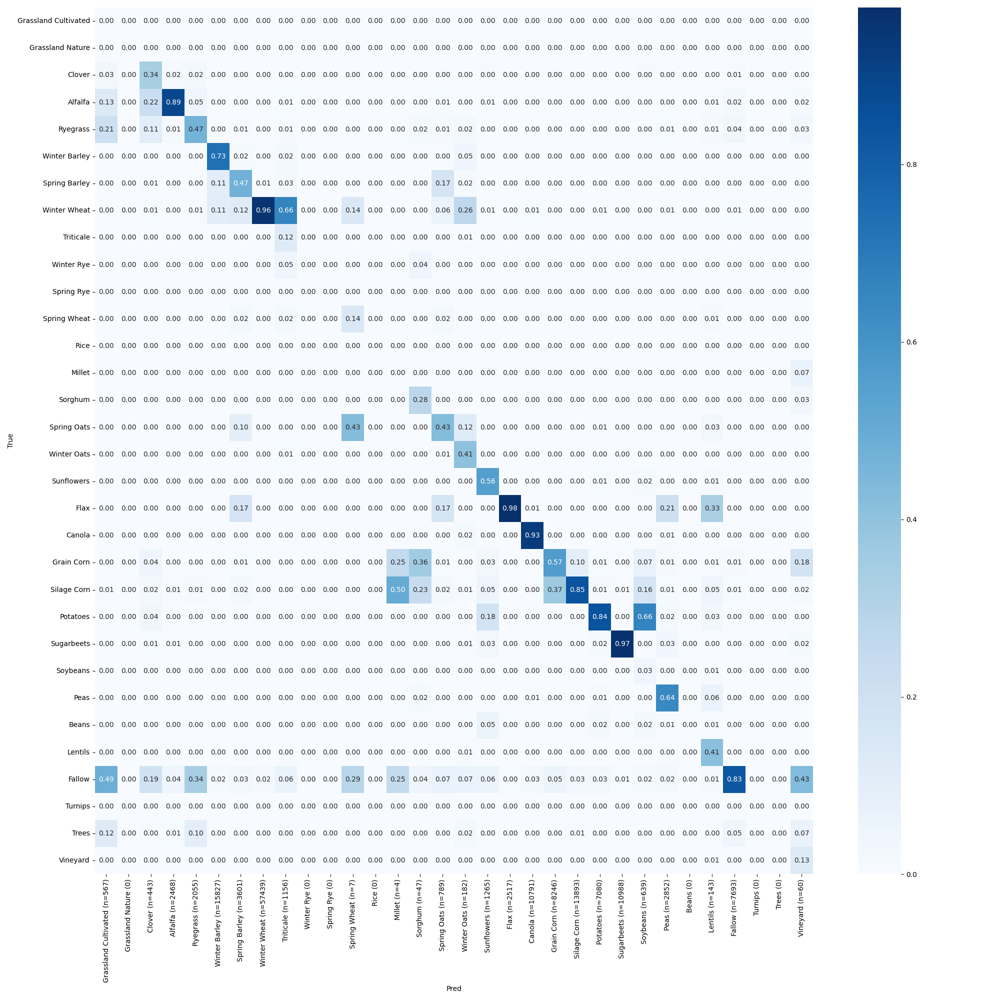
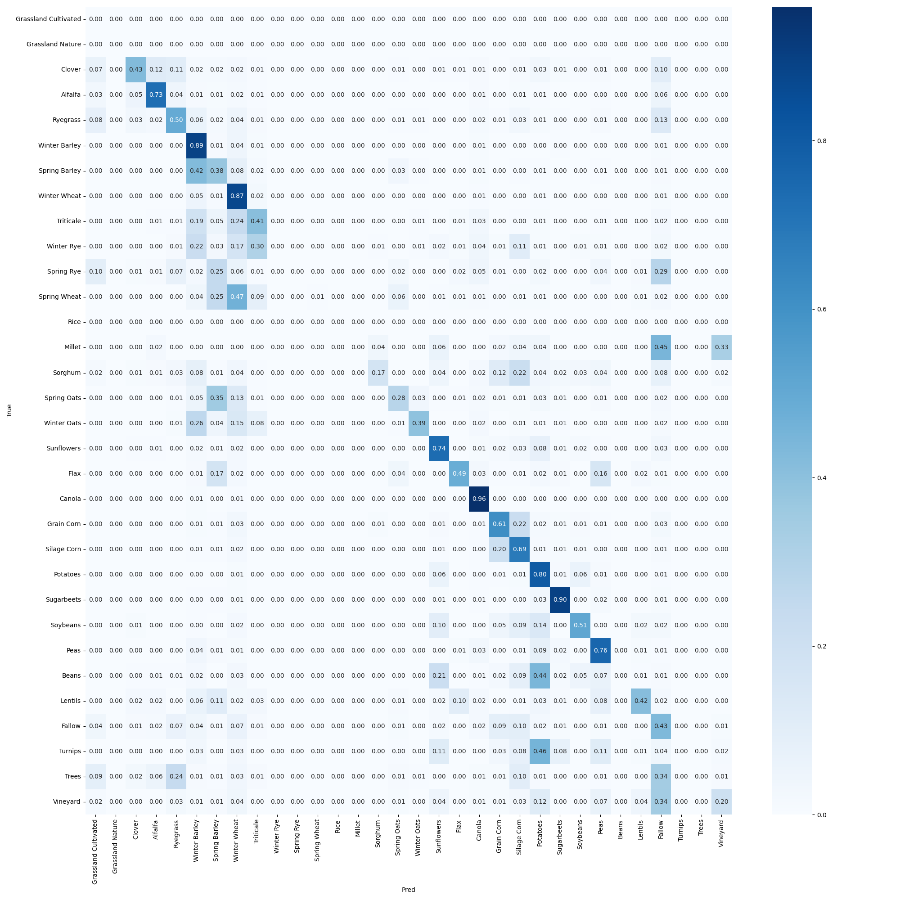

# time-series-crop-model
A demonstration project looking at crop type segmentation using time series.

# Goal
The goals is to implement an active learning approach to systematically detect underperforming crops from the model predictions and strategically incorporate them back into the training pipeline. This process aims to refine the model’s accuracy by iteratively improving its ability to differentiate between crops, particularly in AOIs where it currently struggles due to a lack of representative training data.

The specific tasks are

* Identify underperforming crops from the provided raster dataset.
* Diagnose confusion between crop types and propose a strategy to improve model performance.
* Implement efficient geospatial processing using Rasterio, Geopandas, and parallel computation.
* Provide a structured output and recommendations on how to enhance the training pipeline.

# Getting started

## Dev environment

Ensure you have [Remote Containers extension](https://marketplace.visualstudio.com/items?itemName=ms-vscode-remote.remote-containers) installed in VS Code, then run:

```
docker-compose build devcontainer
docker-compose up -d devcontainer
```

Then use `Devcontainers: Attach to Running Container` command and attach to the `devcontainer-${USER}` container running on your machine.

## Running

The entrypoint for this program is `src/cli.py`. For all available options you can run:

```
python src/cli.py --help
```

Example:

```
python src/cli.py \
-p /code/data/ml_2021-08-01_2022-12-31_u0c.tif \
-l /code/data/u0c_gt_filtered_2022.gpkg \
-o /code/output/ \
-pc 3 \
-cc 4 \
-n 10
```

For the data files used in this repository, please see [this link](https://github.com/regrowag/regrow-mle-hiring/tree/main?tab=readme-ov-file#inputs).

# Reported Analysis
We have determined the following distribution of field-level misclassifications by crop type:



The cross-class confusion matrix on a field basis normalized by the true labels is as follows


The cross-class confusion matrix on a field basis normalized by the predictions is as follows


The cross-class confusion matrix on a pixel basis is as follows


## Observations
We see that in absolute terms, the most commonly incorrectly classified field-level crop type was Fallow, which was incorrectly classified across more than 5000 fields. 
However, it was also the 4th most abundant label in the evaluation set.

Certain classes such as spring rye, spring wheat, and millet were completely missed by the model, but were also not very abundant in the evaluation set.

# TODO
* tests run but dont seem to do anything
* analyze output to see underperformance
