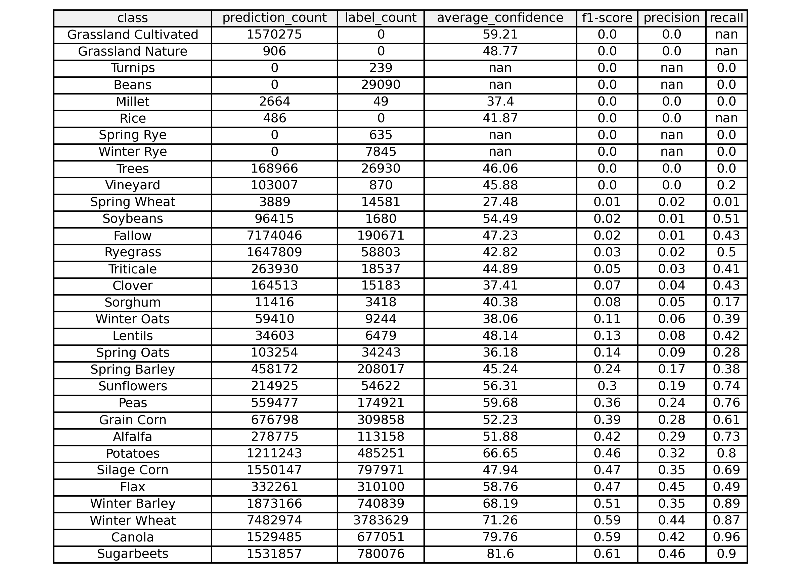
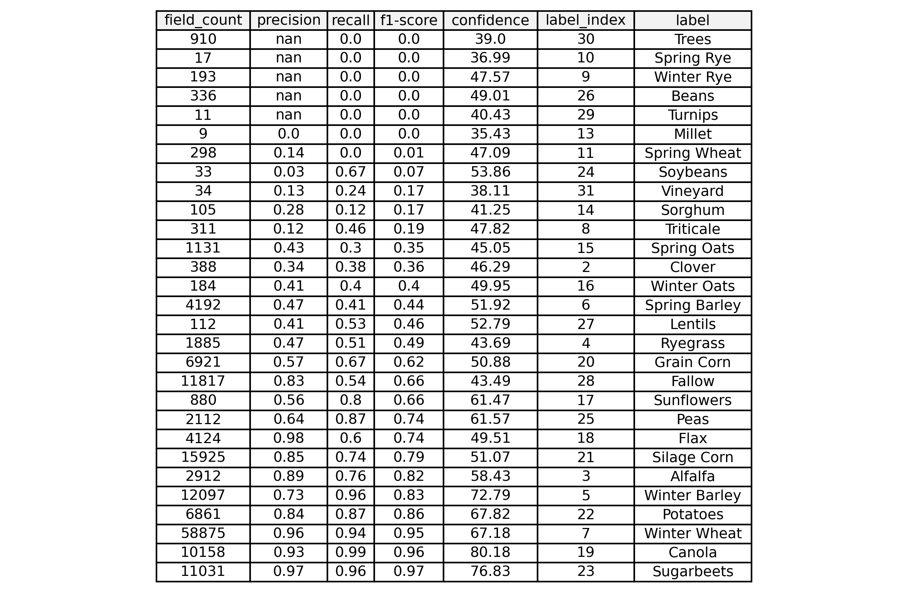
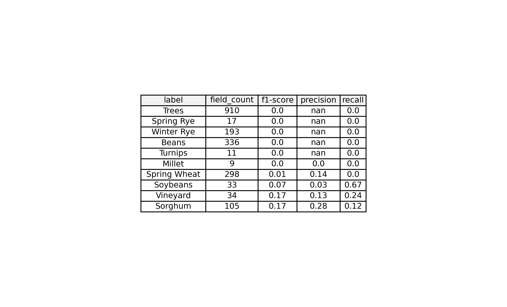

# time-series-crop-model
A demonstration project looking at crop type segmentation using time series.

# Goal
The goal is to implement an active learning approach to systematically detect underperforming crops from the model predictions and strategically incorporate them back into the training pipeline. This process aims to refine the model’s accuracy by iteratively improving its ability to differentiate between crops, particularly in AOIs where it currently struggles due to a lack of representative training data.

The specific tasks are

* Identify underperforming crops from the provided raster dataset.
* Diagnose confusion between crop types and propose a strategy to improve model performance.
* Implement efficient geospatial processing using Rasterio, Geopandas, and parallel computation.
* Provide a structured output and recommendations on how to enhance the training pipeline.

# Getting started

## Dev environment

Ensure you have [Remote Containers extension](https://marketplace.visualstudio.com/items?itemName=ms-vscode-remote.remote-containers) installed in VS Code, then run:

```
docker-compose build devcontainer
docker-compose up -d devcontainer
```

Then use `Devcontainers: Attach to Running Container` command and attach to the `devcontainer-${USER}` container running on your machine. For those that prefer a jupyter lab notebook environment, the container hosts one at `http://0.0.0.0:8888/lab/workspaces/`

## Workflow Orchestration

The entrypoint for this program is `src/cli.py`. For all available CLI options you can run:

```
python src/cli.py --help
```

Example (see `run.sh`):

```
python src/cli.py evaluate \
-p /code/data/ml_2021-08-01_2022-12-31_u0c.tif \
-l /code/data/u0c_gt_filtered_2022.gpkg \
-o /code/output/ \
-pb 3 \
-cb 4 \
-n 10
```

For the data files referenced in this repository, please see [this link](https://github.com/regrowag/regrow-mle-hiring/tree/main?tab=readme-ov-file#inputs).

# Results
We have determined the following distribution of total field-level misclassifications counts by crop type:


The cross-class confusion matrix on a field basis normalized by the true labels is as follows


The cross-class confusion matrix on a field basis normalized by the predictions is as follows


The cross-class confusion matrix on a pixel basis by the true labels is as follows is as follows


The overal pixel-level performance per crop type is as follows (I think there might be a bug for Grassland Cultivated):


The overal field-level performance per crop type is as follows:


The worst 10 crops on the basis of field-level f1 score are as follows:


# Discussion and Future Work
In the context of an active learning scenario, I would recommend incorporating more examples of crop classes for which labels were present in the evaluation set but the model made no observations for. This should be prioritized based on either the prevalence of the crops within the area of application, or based on customer priority. For example, out of the 10 crops with the lowest f1-score, 6 had an f-score of exactly 0, but collectively fields with these crop types represent less than 1% of all fields in the evaluation set (on a count basis, not on area).

Active learning typically involves a human in the loop. We have identified the crops that the model struggles with on an evaluation set, and we would need to identify examples of those types crops to label that come from outside the evaluation set. Once we have these examples, we would have a human label them, incorporate them in the training set, and re-run this evaluation. Ideally we would not see any crops which were present in the evaluation set but for which the model made no predictions. However, this is dependent on the goal, since we might not care much about crop types that have very low representation across the area of interest. Ultimately the objective of this model must be identified in order for comprehensive recommendations on future actions to be properly formulated.

# Notes
* Data was commited to `output/` in order to show work, but normally this data would not be stored in a repository.
* Runtime for script is on the order of ~80 seconds
* One test exists that can be run using `pytest -k test_cli -sv`
* More time should be spent to QA the results